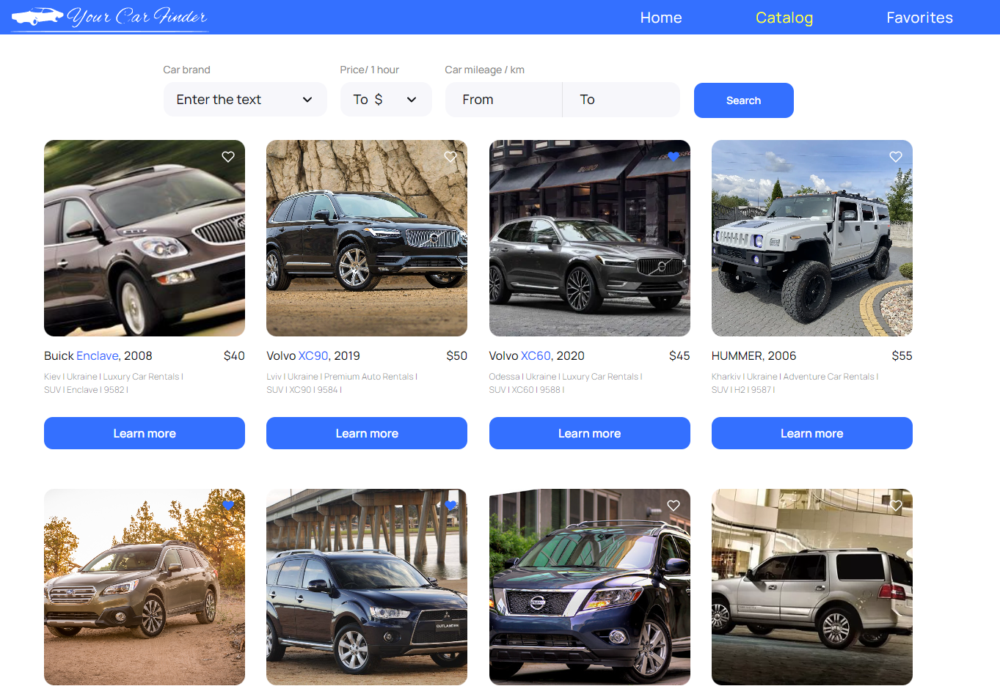

# Car Finder

Car Finder is a web application that allows users to search for cars by various criteria and view detailed information about them. Whether you're looking to buy a new car or just exploring the options available, Car Finder can help you find the right car for your needs.

## Features

- **Search by Make and Model:** Easily search for cars by specifying the make and model you're interested in.
- **View Car Details:** Get comprehensive information about each car, including specifications, pricing, and more.
- **Save Favorites:** Save your favorite car listings for later reference.

## Getting Started

To get started with Car Finder, simply visit the [Car Finder website](https://wiperrr.github.io/car-finder/) and start searching for cars. You can use the search bar to specify your criteria and browse the results. If you find a car you like, you can click on it to view more details.

## Technologies Used

Car Finder is built using the following technologies:

- **React:** A JavaScript library for building user interfaces.
- **React Router:** For handling routing within the application.
- **CSS Modules:** For styling components.
- **GitHub Pages:** Hosting the website.

## Contributing

If you'd like to contribute to Car Finder, feel free to open an issue or submit a pull request on the [GitHub repository](https://github.com/wiperrr/car-finder). We welcome contributions and feedback from the community.

## Acknowledgments

- Car data is provided by [CarAPI](https://mockapi.io/).
- This project was created as a learning exercise and for demonstration purposes.
